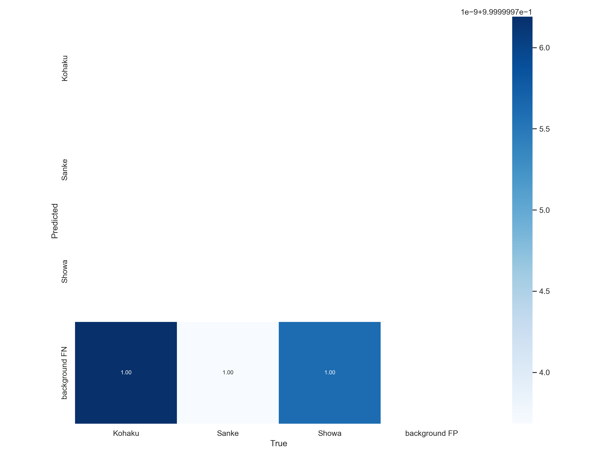

# 錦鯉魚AI辨識分類專案 KOI Detection Project

> 該專案將錦鯉依不同類別等級進行區分，利用YOLOv7 PyTorch訓練，以利於消費者進行識別

## 訓練結果

### Training Session V0

> labels=3, images=426, Epoch=10, img_size=640, batch_size=2

* 重點

    本次訓練對象為御三家(Gosanke)，做為測試用途，主要是測試手上Nvidia的獨顯是否可以運行YOLOv7的訓練，同時檢驗運用YOLO辨識魚種之可行性。

* 結果

    出現了慘無人道的結果，推測為樣本品質過低
    

### Training Session V1

> labels=3, images=667, Epoch=50, img_size=640, batch_size=2

* 重點

    本次訓練對象為御三家(Gosanke)，我們擷取網路上介紹御三家的影片([Sanke Koi Selection | How to select a good Sanke Koi?](https://www.youtube.com/watch?v=MXO7JGjLUDg)、[Kohaku Koi variety in 8 minutes | Koi documentary](https://www.youtube.com/watch?v=S7FvNtXAtl0)、[SHOWA KOI variety 5 minutes | Koi documentary](https://www.youtube.com/watch?v=E5iOAw_By1I))，並利用[Roboflow](https://app.roboflow.com/)進行智慧樣本標記，從而獲得更複雜的背景及魚隻樣本。

* 結果
    123
