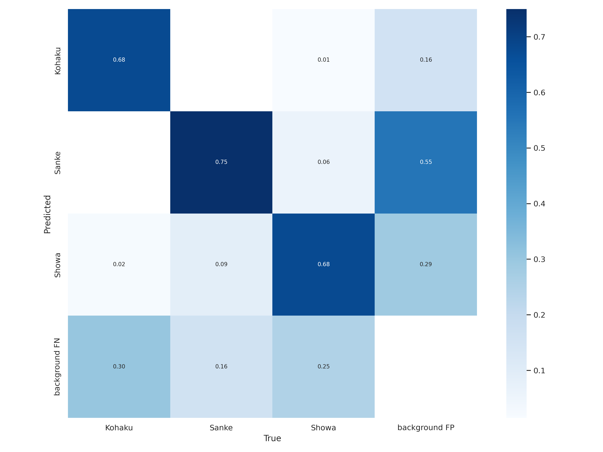

# 錦鯉魚AI辨識分類專案 KOI Detection Project

> 該專案將錦鯉依不同類別等級進行區分，利用YOLOv7 PyTorch訓練，以利於消費者進行識別

## 錦鯉圖片資料集Koi Dataset

* 簡介

    這是一個錦鯉魚的資料集，整理自自行拍攝之影像及Kaggle [train-koi](https://www.kaggle.com/datasets/dangtantai/trainkoi)、[Dataset Images Koi](https://www.kaggle.com/datasets/farizp/dataset-images-koi)、[Koi_Fish](https://www.kaggle.com/datasets/quchphhng/koifish)，並使用了[Roboflow](https://app.roboflow.com/)擷取了來自"[Sanke Koi Selection | How to select a good Sanke Koi?](https://www.youtube.com/watch?v=MXO7JGjLUDg)"、"[Kohaku Koi variety in 8 minutes | Koi documentary](https://www.youtube.com/watch?v=S7FvNtXAtl0)"、"[SHOWA KOI variety 5 minutes | Koi documentary](https://www.youtube.com/watch?v=E5iOAw_By1I)"影片中的圖片進行智慧標記做為樣本使用。

* 類別

    |已標記|中文全名|英文名稱|已標記|中文全名|英文名稱|
    |---|---|---|---|---|---|
    | - [ ] |淺黃|Asagi| - [x] |大白|Kohaku|
    | - [x] |大正三色|Taisho Sanke| - [x] |昭和三色|Showa Sanke|
    | - [ ] |寫類|Utsurimono| - [ ] |別光|Bekko|
    | - [ ] |衣|Koromo| - [ ] |五色|Goshiki|
    | - [ ] |光無地|Hikarimuji| - [ ] |光模樣|Hikarimoyo|
    | - [ ] |丹頂|Tancho| - [ ] |金銀鱗|Kinginrin|
    | - [ ] |秋翠|Shusui| - [ ] |孔雀|Kujaku|
    | - [ ] |九紋龍|Kumonryu| - [ ] |變種鯉|Kawarigoi|
    | - [ ] |逸品鯉|Unique Koi| - [ ] |德國鏡鯉|Doitsu|

## 訓練結果

### Training Session V0

> labels=3, images=667, Epoch=150, img_size=640, batch_size=4

* 重點

    本次訓練對象為御三家(Gosanke)，做為測試用途，主要是測試手上Nvidia的獨顯是否可以運行YOLOv7的訓練，同時檢驗運用YOLO辨識魚種之可行性。

* 結果

    從混淆矩陣中，我們發現熟悉的圖回來了，其中三色(Sanke)的偵測正確率高達75%，至少超過50%就算有成效了(不過寫論文的話大概還不太有說服力)，且訝異的是並沒有出現大正(Showa)跟三色(Sanke)的混淆現象，還要進一步了解是樣本瑕疵還是訓練成效。而其中三色(Sanke)高達55%的背景FP或許代表三色(Sanke)的樣本有些不足。

    
