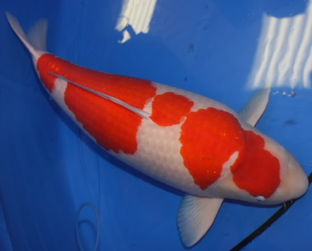
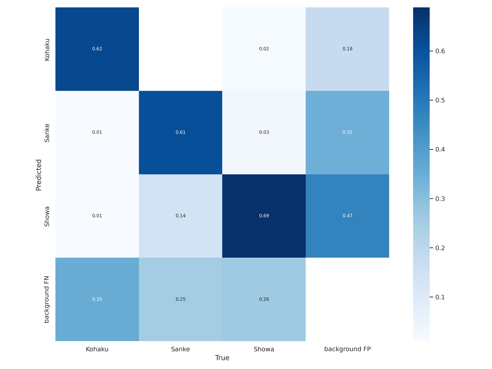

# 錦鯉魚AI辨識分類專案 KOI Detection Project

* 簡介

    本專案將[錦鯉](https://en.wikipedia.org/wiki/Koi)依不同類別等級進行區分，利用[YOLOv7](https://github.com/WongKinYiu/yolov7)、[PyTorch](https://pytorch.org/)訓練，以利於消費者進行識別。

    

* 動機

    鑒於國人對錦鯉魚種類集價位認知不足，本研究計畫開發應用程式並建置錦鯉魚種類辨識系統，並增加品質鑑定功能，針對錦鯉魚常見疾病作辨識，讓喜歡錦鯉魚的國人透過本開發軟體獲得更多錦鯉知識，從而學習錦鯉魚飼養與疾病防治等議題。

    

* 目的

    以[YOLOv7](https://github.com/WongKinYiu/yolov7)、[PyTorch](https://pytorch.org/)等開源程式碼為基底開發的錦鯉魚辨識系統，針對鯉魚玩賞者，開發功能完整的應用程式，可依花紋、顏色判別鯉魚的品種，標註大小，分析可能的疾病，並依先前市場各種鯉魚的出售價格，做出相對的估價。

## 錦鯉圖片資料集Koi Dataset

(自[koi](https://github.com/kelvinlinkk/koi)併入，可以點選[超連結](https://github.com/kelvinlinkk/koi)回顧舊版頁面)

* 簡介

    這是一個錦鯉魚的資料集，整理自自行拍攝之影像及Kaggle [train-koi](https://www.kaggle.com/datasets/dangtantai/trainkoi)、[Dataset Images Koi](https://www.kaggle.com/datasets/farizp/dataset-images-koi)、[Koi_Fish](https://www.kaggle.com/datasets/quchphhng/koifish)，並使用了[Roboflow](https://app.roboflow.com/)擷取了來自"[Sanke Koi Selection | How to select a good Sanke Koi?](https://www.youtube.com/watch?v=MXO7JGjLUDg)"、"[Kohaku Koi variety in 8 minutes | Koi documentary](https://www.youtube.com/watch?v=S7FvNtXAtl0)"、"[SHOWA KOI variety 5 minutes | Koi documentary](https://www.youtube.com/watch?v=E5iOAw_By1I)"影片中的圖片進行智慧標記做為樣本使用。

* 類別

    |已標記|中文全名|英文名稱|已標記|中文全名|英文名稱|
    |---|---|---|---|---|---|
    |F|淺黃|Asagi|T|大白|Kohaku|
    |T|大正三色|Taisho Sanke|T|昭和三色|Showa Sanke|
    |F|寫類|Utsurimono|F|別光|Bekko|
    |F|衣|Koromo|F|五色|Goshiki|
    |F|光無地|Hikarimuji|F|光模樣|Hikarimoyo|
    |F|丹頂|Tancho|F|金銀鱗|Kinginrin|
    |F|秋翠|Shusui|F|孔雀|Kujaku|
    |F|九紋龍|Kumonryu|F|變種鯉|Kawarigoi|
    |F|逸品鯉|Unique Koi|F|德國鏡鯉|Doitsu|

## 訓練結果

### Training Session VA-1

> labels=3, images=667, Epoch=150, img_size=640, batch_size=4

* 重點

    VA系列之訓練對象為御三家(Gosanke)，做為測試用途，主要是測試手上Nvidia的獨顯是否可以運行YOLOv7的訓練，同時檢驗運用YOLO辨識魚種之可行性。

* 結果

    從混淆矩陣中，我們發現熟悉的圖回來了，其中三色(Sanke)的偵測正確率高達75%，至少超過50%就算有成效了(不過寫論文的話大概還不太有說服力)，且訝異的是並沒有出現大正(Showa)跟三色(Sanke)的混淆現象，還要進一步了解是樣本瑕疵還是訓練成效。而其中三色(Sanke)高達55%的背景FP或許代表三色(Sanke)的樣本有些不足。

    

### Training Session VB-1

> labels=?, images=?, Epoch=?, img_size=640, batch_size=4

* 重點

    VB系列隻訓練對象為錦鯉魚常見的疾病。目前本研究採取雙步驟辨識，將魚隻和疾病分為兩步驟進行檢視，已提高兩模型分別之執行效率。

* 結果

    (尚在訓練中)
